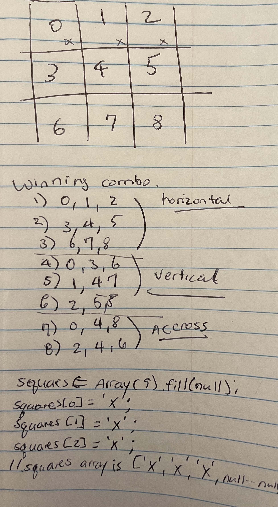

# tic tac toe using React Hooks


- [Resource](https://github.com/codeSTACKr/react-tic-tac-toe-hooks)
- [video](https://youtu.be/08r9mDQvXpU)

- Main component: Game.js

### Approach: start at the very smallest component and work my way up.
#### - inside of square.js)
```js
import React from 'react';

// props destructuring { }, value is X or O in TicTacToe
const Square = ({ value, onClick }) => {

  return (
    <button onClick={onClick}>
      {value}
    </button>
  );
}

export default Square;
```

- Challenge: 
given: Square component switch style:
    - if the values (X or O) are `null` => 'squares'
    - if value is ! `null` => `square ${value}` to the button style.

```js
const Square = ({ value, onClick }) => {

  // if value => `square ${value}`
  // if val is `null` => `squares`
  const style

  return (
    <button onClick={onClick}>
      {value}
    </button>
  );
}
```

* Attempt-1:
```js
const Square = ({ value, onClick }) => {

  // if value => `squares ${value}`
  // if val is `null` => `squares`
  const style = value ? `squares ${value}` : `squares`;

  return (
    <button className={style} onClick={onClick}>
      {value}
    </button>
  );
}
```

* Attempt-2:
```js
const Square = ({ value, onClick }) => {

  // if value => `squares ${value}`
  // if val is `null` => `squares`
  const style = value ? `squares ${value}` : `squares`;

  return (
    <button className={style} onClick={onClick}>
      {value}
    </button>
  );
}
```

#### next create Square.js 

- Javascript: `Array(9).fill('heggy')` => ["heggy", "heggy", "heggy", "heggy", "heggy", "heggy", "heggy", "heggy", "heggy"]

- `Array(9).fill(null)` => [null, null, null, null, null, null, null, null, null]




* [code](https://jsfiddle.net/heggycastaneda/ot3yvzgn/11/)

- explanation of winning combo to decl
```js
squares = Array(9).fill(null); //array of length 9; each of the 9 elements are set to null >> [null, null, ..., null]

squares [0] = 'X'; //simulate player puting X in box 0 (see image in results)
squares [1] = 'X'; //putting X in box 1
squares [2] = "X"; //and in box 3

// the squares array is now ['X', 'X', 'X', null, null, ..., null]

function calculateWinner(squares) {
	// the lines array below is for every winning combination
  // i.e. there is a winner if there is the same letter (i.e 'X') in boxes 0, 1, and 2 (the first combination below)
  const lines = [
  	[0, 1, 2],
    [3, 4, 5],
    [6, 7, 8],
    [0, 3, 6],
    [1, 4, 7],
    [2, 5, 8],
    [0, 4, 8],
    [2, 4, 6],
  ];
  for (let i = 0; i < lines.length; i++){
  	// set a, b, c varialbles with [0, 1, 2] lines[0] array values.  a=0, b=1, c=2
  	const [a, b, c] = lines[i]; 
     // check if player X has won by connecting 3 dots in a row
 		// checks winning combo if squares[0] has Value, the same value for b, c 
    if (squares[a] && squares[a] === squares[b] && squares[a] === squares[c]) {
      // X, X, X exist with winning combo, declare winner!
      return squares[a];
    }
  }
  return null;
```